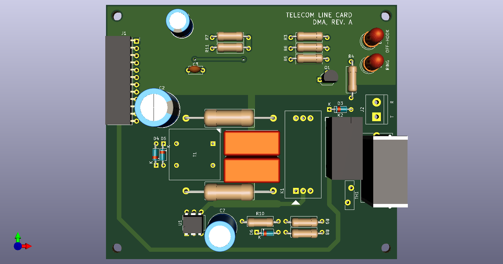

# Telephone Line Card

A twisted pair local loop interface for land line telephones. Performs similar functions to a telephone central office such as: loop battery feed, off-hook detection, ring voltage switching, and isolation to the voice line switching network.

Requires a 24-48VDC input to provide power from the battery and a external 90VAC for ringing. You can use a ringing generator module such as Cambridge Labs: Black Magic or a Power Dsine PCR-SIN03V12F20-C

